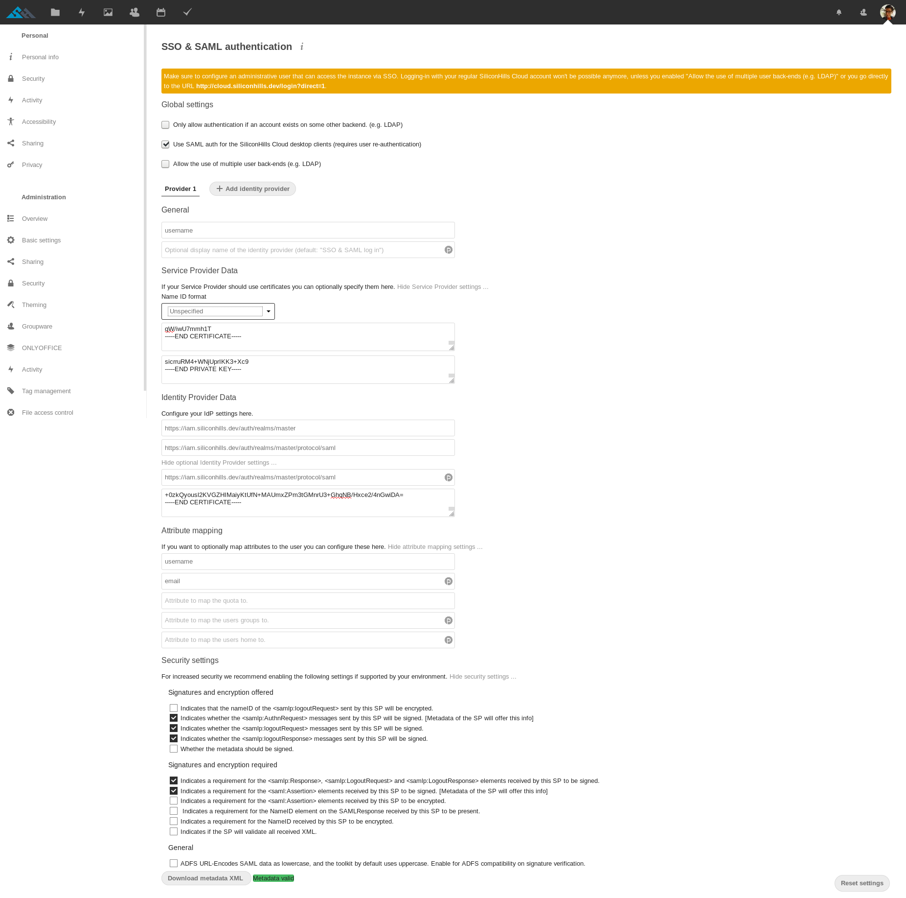

## Configure NextCloud

### Generate Private Key and Certificate

Make sure `overwriteprotocol` is set to `https`
```php
$CONFIG = array (
  'overwriteprotocol' => 'https'
)
```

```sh
openssl req -x509 -sha256 -nodes -days 365 -newkey rsa:2048 -keyout myservice.key -out myservice.cert
```

### Install SSO & SAML Authentication App

**Apps** -> **Integration** -> **SSO & SAML authentication** -> **Download and enable**

### Configure SSO & SAML Authentication App

**Settings** -> **SSO & SAML authentication** -> **Use build-in SAML authentication**

> You can get the Public X.509 certificate of the IdP by navigating to
> **Realm Settings** -> **General** -> **Endpoints** -> **SAML 2.0 Identity Provider Metadata**
> at [https://keycloak.example.com/auth/admin](https://keycloak.example.com/auth/admin)

> Make sure you _Show optional Identity Provider settings ..._

> Make sure you _Show attribute mapping settings ..._

> Make sure you _Show security settings ..._

| Key                                                                                                                                           | Value                                                                                      |
| ------------------------------------------------------------------------------------------                                                    | ------------------------------------------------------------------------------------------ |
| Use SAML auth for the SiliconHills Cloud desktop clients (requires user re-authentication)                                                    | `true`                                                                                     |
| Attribute to map UID to                                                                                                                       | `username`                                                                                 |
| X.509 certificate of the Service Provider                                                                                                     | contets of `myservice.cert`                                                                |
| Private key of the Service Provider                                                                                                           | contets of `myservice.key`                                                                 |
| Identifier of the IdP                                                                                                                         | `https://keycloak.example.com/auth/realms/master`                                          |
| URL Target of the IdP where the SP will send the Authentication Request Message                                                               | `https://keycloak.example.com/auth/realms/master/protocol/saml`                            |
| URL Location of IdP where the SP will send the SLO Request                                                                                    | `https://keycloak.example.com/auth/realms/master/protocol/saml`                            |
| Public X.509 certificate of the IdP                                                                                                           | Value of the the Public X.509 certificate of the IdP                                       |
| Attribute to map the displayname to.                                                                                                          | `username`                                                                                 |
| Attribute to map the email address to.                                                                                                        | `email`                                                                                    |
| Indicates that the nameID of the <samlp:logoutRequest> sent by this SP will be encrypted.                                                     | `false`                                                                                    |
| Indicates whether the <samlp:AuthnRequest> messages sent by this SP will be signed. [Metadata of the SP will offer this info]                 | `true`                                                                                     |
| Indicates whether the  <samlp:logoutRequest> messages sent by this SP will be signed.                                                         | `true`                                                                                     |
| Indicates whether the  <samlp:logoutResponse> messages sent by this SP will be signed.                                                        | `true`                                                                                     |
| Whether the metadata should be signed.                                                                                                        | `false`                                                                                    |
| Indicates a requirement for the <samlp:Response>, <samlp:LogoutRequest> and <samlp:LogoutResponse> elements received by this SP to be signed. | `true`                                                                                     |
| Indicates a requirement for the <saml:Assertion> elements received by this SP to be signed. [Metadata of the SP will offer this info]         | `true`                                                                                     |
| Indicates a requirement for the <saml:Assertion> elements received by this SP to be encrypted.                                                | `false`                                                                                    |
| Indicates a requirement for the NameID element on the SAMLResponse received by this SP to be present.                                         | `false`                                                                                    |
| Indicates a requirement for the NameID received by this SP to be encrypted.                                                                   | `false`                                                                                    |
| Indicates if the SP will validate all received XML.                                                                                           | `false**                                                                                   |

Select **Download metadata XML***

## Configure Keycloak

Import the `metadata.xml` file downloaded while configuring NextCloud

**Clients** -> **Create** -> **Import** -> **Select File**

Select **Save**

Change **Valid Redirect URIs** from `https://nextcloud.example.com/apps/user_saml/saml/acs` to `https://nextcloud.example.com/*`

Remove `role_list` from **Client Scopes** -> **Setup** -> **Assigned Default Client Scopes**


